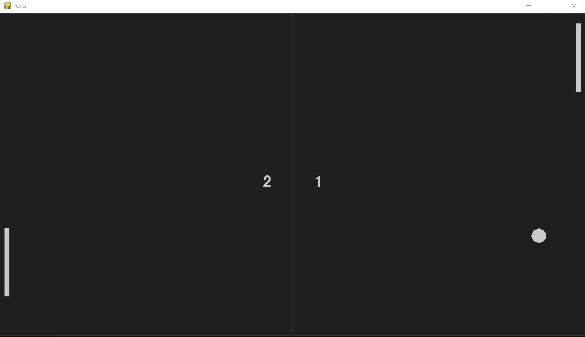

## Pong-Game
Pong game using pygame module of Python.

### Tools and Languages


<br>

### Libraries Required
-pygame<br>
-sys<br>
-random

### Breaking down the code

```Python
import pygame
import sys
import random
```
Lets start with importing required libraries.

```python
def ball_animation():
	global ball_speed_x, ball_speed_y, player_score, opponent_score, score_time
	
	ball.x += ball_speed_x
	ball.y += ball_speed_y

	if ball.top <= 0 or ball.bottom >= screen_height:
		ball_speed_y *= -1
	
	# Player Score
	if ball.left <= 0: 
		score_time = pygame.time.get_ticks()
		player_score += 1

	# Opponent Score
	if ball.right >= screen_width:
		score_time = pygame.time.get_ticks()
		opponent_score += 1

	if ball.colliderect(player) and ball_speed_x > 0:
		if abs(ball.right - player.left) < 10:
			ball_speed_x *= -1	
		elif abs(ball.bottom - player.top) < 10 or abs(ball.top - player.bottom) < 10 :
			ball_speed_y *= -1

	if ball.colliderect(opponent):
		if abs(ball.left - opponent.right) < 10 or abs(ball.right - player.left) < 10:
			ball_speed_x *= -1	
		else:
			ball_speed_y *= -1
```
This function sets up the animation for the ball.

```python
def player_animation():
	player.y += player_speed

	if player.top <= 0:
		player.top = 0
	if player.bottom >= screen_height:
		player.bottom = screen_height
```
This function sets up the animation for the player.

```python
def opponent_animation():
	if opponent.top < ball.y:
		opponent.y += opponent_speed
	if opponent.bottom > ball.y:
		opponent.y -= opponent_speed

	if opponent.top <= 0:
		opponent.top = 0
	if opponent.bottom >= screen_height:
		opponent.bottom = screen_height
```
This function sets up the animation for the opponent.

```python
def ball_restart():
	global ball_speed_x, ball_speed_y, ball_moving, score_time

	ball.center = (screen_width//2, screen_height//2)
	current_time = pygame.time.get_ticks()

	if current_time - score_time < 700:
		number_three = basic_font.render("3",False,light_grey)
		screen.blit(number_three,(screen_width//2 - 10, screen_height//2 + 20))
	if 700 < current_time - score_time < 1400:
		number_two = basic_font.render("2",False,light_grey)
		screen.blit(number_two,(screen_width//2 - 10, screen_height//2 + 20))
	if 1400 < current_time - score_time < 2100:
		number_one = basic_font.render("1",False,light_grey)
		screen.blit(number_one,(screen_width//2 - 10, screen_height//2 + 20))

	if current_time - score_time < 2100:
		ball_speed_y, ball_speed_x = 0,0
	else:
		ball_speed_x = 7 * random.choice((1,-1))
		ball_speed_y = 7 * random.choice((1,-1))
		score_time = None
```
Ball Restart function.

```python
pygame.init()
clock = pygame.time.Clock()
```
Pygame module setup.

```python
screen_width = 1200
screen_height = 660
screen = pygame.display.set_mode((screen_width,screen_height))
pygame.display.set_caption('Pong')
```
Game window setup.

``python
light_grey = (200,200,200)
bg_color = pygame.Color('grey12')
```
 Color initialization
 
 ```python
ball = pygame.Rect(screen_width // 2 - 15, screen_height // 2 - 15, 30, 30)
player = pygame.Rect(screen_width - 20, screen_height // 2 - 70, 10,140)
opponent = pygame.Rect(10, screen_height // 2 - 70, 10,140)
 ```
 Game rectangles
 
```python
ball_speed_x = 7 * random.choice((1,-1))
ball_speed_y = 7 * random.choice((1,-1))
player_speed = 0
opponent_speed = 10
ball_moving = False
score_time = True
```
Game variables

```python
player_score = 0
opponent_score = 0
basic_font = pygame.font.Font('freesansbold.ttf', 32)

while True:
	for event in pygame.event.get():
		if event.type == pygame.QUIT:
			pygame.quit()
			sys.exit()
		if event.type == pygame.KEYDOWN:
			if event.key == pygame.K_UP:
				player_speed -= 7
			if event.key == pygame.K_DOWN:
				player_speed += 7
		if event.type == pygame.KEYUP:
			if event.key == pygame.K_UP:
				player_speed += 7
			if event.key == pygame.K_DOWN:
				player_speed -= 7
	
	#Game Logic
	ball_animation()
	player_animation()
	opponent_animation()

	# Visuals 
	screen.fill(bg_color)
	pygame.draw.rect(screen, light_grey, player)
	pygame.draw.rect(screen, light_grey, opponent)
	pygame.draw.ellipse(screen, light_grey, ball)
	pygame.draw.aaline(screen, light_grey, (screen_width // 2, 0),(screen_width // 2, screen_height))

	if score_time:
		ball_restart()

	player_text = basic_font.render(f'{player_score}',False,light_grey)
	screen.blit(player_text,(645,330))

	opponent_text = basic_font.render(f'{opponent_score}',False,light_grey)
	screen.blit(opponent_text,(540,330))

	pygame.display.flip()
	clock.tick(60)
```
Game logic

### Demo


### Developed By:
[Ankit Mohanty](https://github.com/sovan580)
